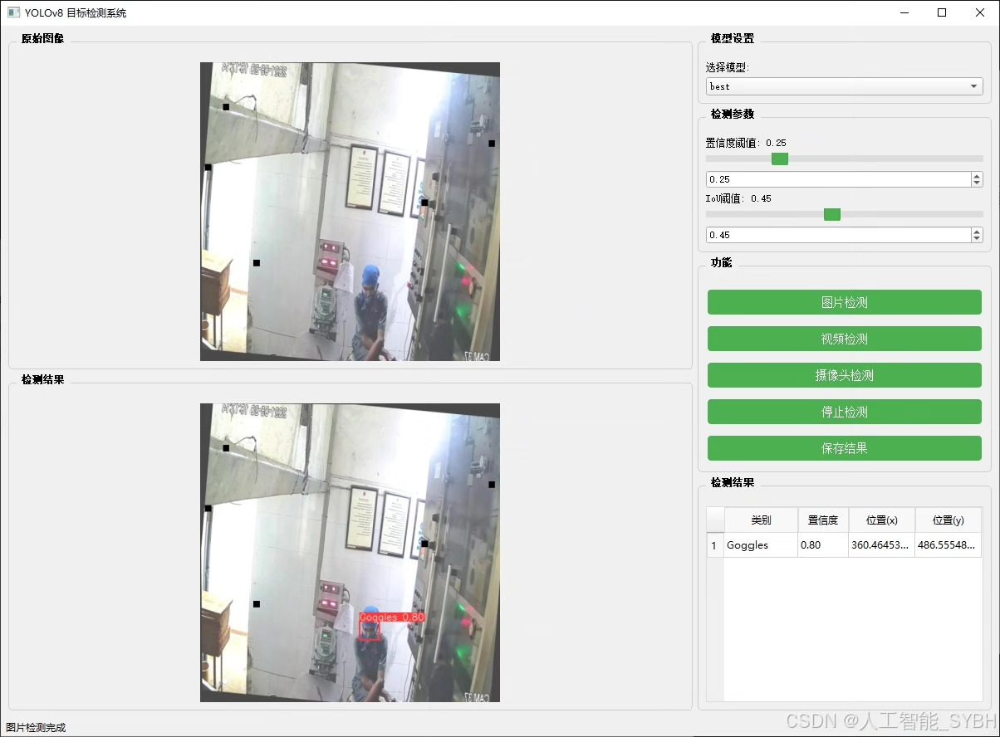
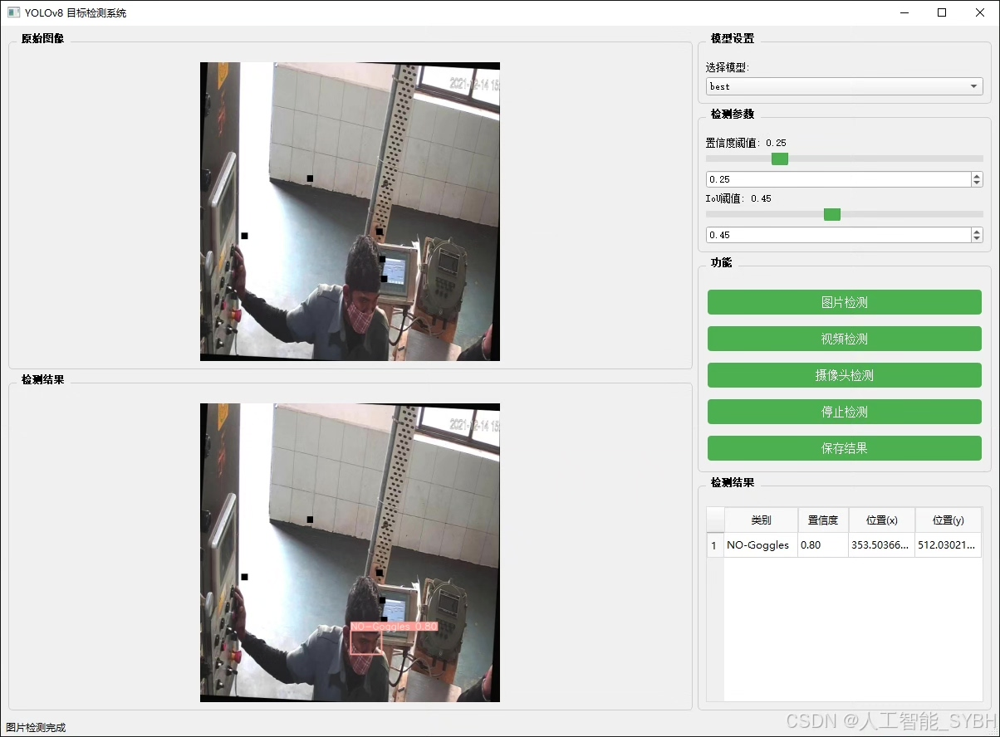
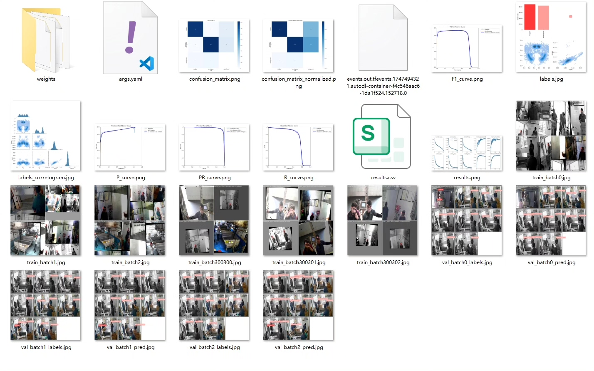
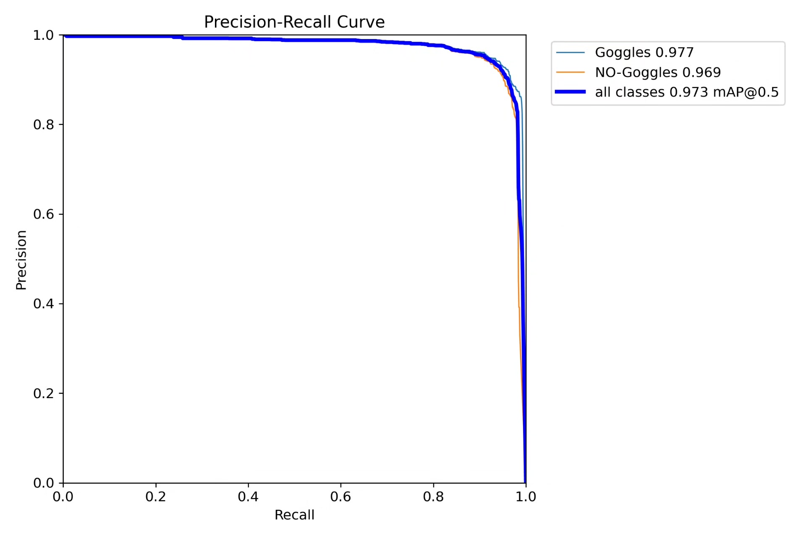
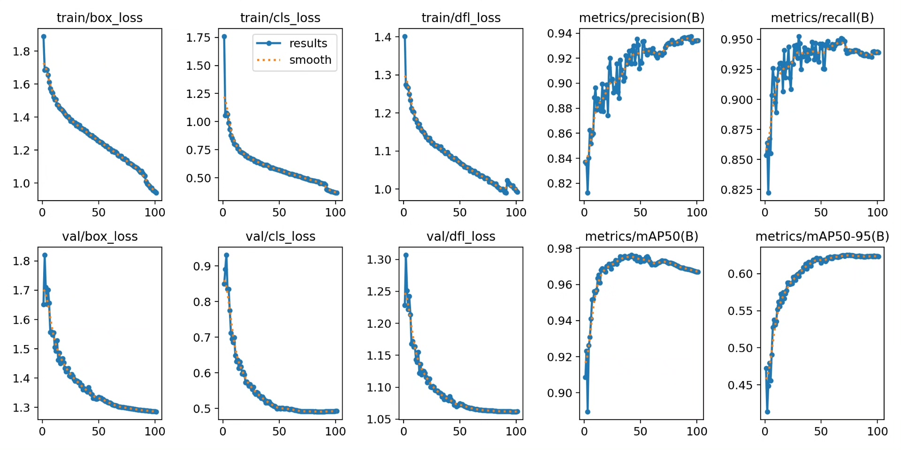
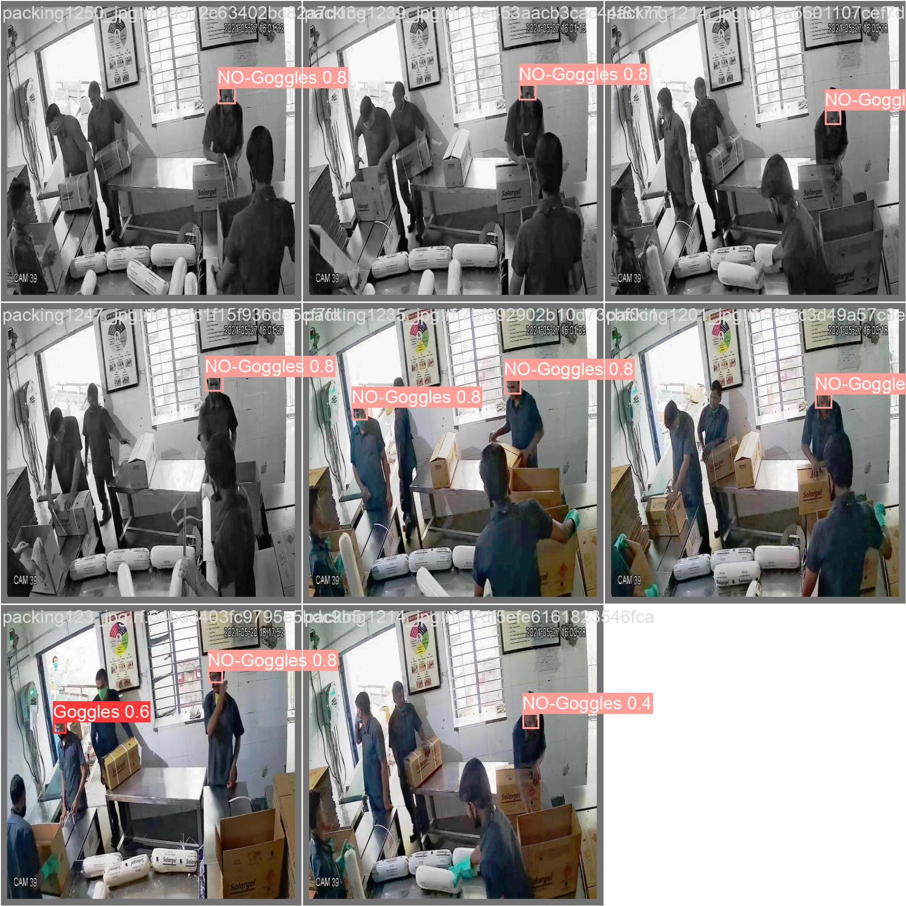
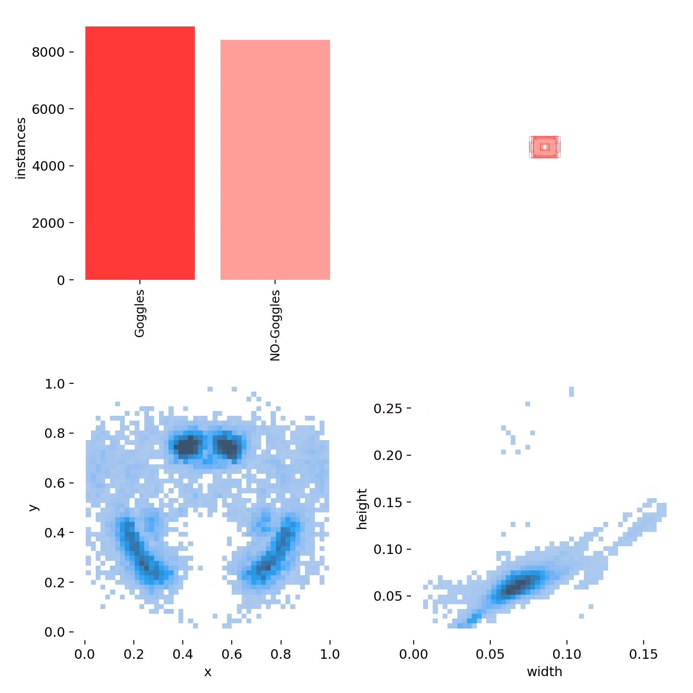
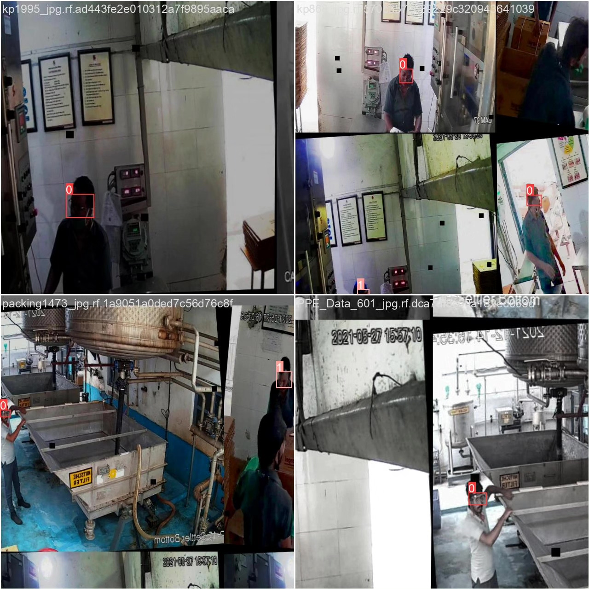

# Based on deep learning YOLOv8, a goggles wearing detection system for protection (YOLOv

## Body

This project is based on the advanced YOLOv8 object detection algorithm to develop a high-precision goggles wearing recognition detection system. It can accurately identify whether staff members are wearing goggles ('Goggles' and 'NO-Goggles' categories). The system utilizes deep learning technology, training and optimizing on a large-scale dataset containing 13,200 training images, 1,256 validation images, and 627 test images, ensuring robustness and generalization capabilities in various complex environments.

The company's products have obtained YOLO official commercial license certification.

We provide after-sales service.

After payment, we will provide WeChat ID for any questions.

Environment configuration: We will provide an environment configuration tutorial, and WeChat will provide answers.

Remote installation service: If you need remote configuration, an additional fee of 69 is required.
If the configuration fails, all fees will be refunded (specially for old computers only refund installation fees).

Retraining dataset: After setting up the environment, you can train on your own computer.
If you need us to train it, just pay 69 plus computing power fees (2.5 yuan/hour).

Full after-sales service

## Images

## Payment

Here is a pay link on Stripe ( https://buy.stripe.com/3cs8yP7sY87d0vu9AB ). Please contact me lonlonago@foxmail.com after funding $89, and I will send you a complete data files , thank you!

